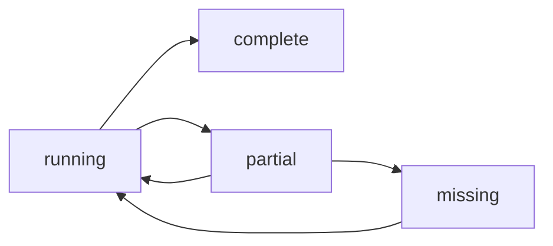

# 3. Arc State and Data Metadata

Date: 2023-02-08

## Status

Draft

## Context

There are four key runtime abstractions -- `arc`, `workload`, `dataset` (being consumed or produced), and a `lot`.

A `lot` is a set of data objects (files etc.) that have arrived during a given interval (e.g. a 5 minute period,
13:00:00.000 to 13:04:59.999) that belong to a logical dataset, which is the set of all lots that have arrived and are
available for processing. That is, a `lot` is a subset of a dataset.

When a `lot` becomes available, the lot-availability-event is published as an event that can be subscribed to by an arc.

If lots are continuously arriving, and are partitioned at 5 minute intervals, data will be processed by an arc every 5
minutes, and any missing lots can be easily identified.

```text
        ╔════════════════════════════════╗
        ║Arc                             ║
        ║            ┌───────┐           ║
        ║┌──────────┐│Process│           ║
        ║│ Dataset  │└───────┘           ║
        ║└──────────┘    _               ║
        ║  .─────.      ╱ ╲      .─────. ║
        ║ (|||||||)═══▶▕   ▏═══▶(|||||||)║
        ║  `─────'      ╲ ╱      `─────' ║
        ║                ▔               ║
        ╚════════════════════════════════╝
```

Arc state is the state of an arc instance, where an arc instance starts on receiving a subscribed lot availability
event, executes a process, and then publishes a new `lot` availability event.

```text
           ┌───────┐
           │Process│
           └───────┘
               _
              ╱ ╲
             ▕   ▏
              ╲ ╱   ┌─────────┐
               ▔    │Children │
               │    └─────────┘
      ┌─────┬──┴──┬─────┐
      │     │     │     │
      ▼     ▼     ▼     ▼
    ┌ ─ ┐ ┌ ─ ┐ ┌ ─ ┐ ┌ ─ ┐
                  ...
    └ ─ ┘ └ ─ ┘ └ ─ ┘ └ ─ ┘
```

Processing state is the execution state of processing instance. A dataset lot may be partitioned and handled by a set of
child processes, each of which may succeed or fail.

That is, if a lot instance for a source dataset contains data partitioned by year/month/day, the implementation could
spawn workers for each unique partition in order to parallelize the work. One child processing job for
`<prefix>/year=2023/month=01/day=01`, another for `<prefix>/year=2023/month=01/day=02`, and so on, depending on the
member objects in the dataset lot.

```text
         ┌──────────┐
         │ Dataset  │
         └──────────┘
            .─────.
           (|||||||) ┌─────────┐
            `─────'  │  Parts  │
               │     └─────────┘
      ┌─────┬──┴──┬─────┐
      │     │     │     │
      ▼     ▼     ▼     ▼
    ┌ ─ ┐ ┌ ─ ┐ ┌ ─ ┐ ┌ ─ ┐
                  ...
    └ ─ ┘ └ ─ ┘ └ ─ ┘ └ ─ ┘
```

The parent process will produce a new logical dataset lot, this dataset lot is simply the sum of all the physical parts
produced by the child processes when handling the source dataset lot partitions.

If one of the children fail, the overall process also fails, and the arc fails. But the other children may succeed.

If the failure was transient, the whole arc should be replayed, but only the child processes associated with failed
partitions should be executed, the successful partitions should be skipped. Any data created by the failed partition
process should have been removed after failure, but must be removed on the completion of the retry.

A process executed by an arc creates a new dataset lot with data in a new location. On completion the process should
point to a bill of materials, or manifest, containing the results of the actual data written.

Thus, a dataset lot is simply a manifest of all the objects it contains.

## Decision

```text
    ┌ ─ ─ ─ ─ ─ ─ ─ ─ ─ ─ ─ ─ ─ ─ ─
     Arc Process                   │
    │Statemachine             _
        .───────────.        ╱ ╲   │
    │  (  arc state  )◀ ─ ─ ▕   ▏
        `───────────'        ╲ ╱   │
    │                         ▔
     ─ ─ ─ ─ ─ ─ ─ ─ ─ ─ ─ ─ ─│─ ─ ┘
                              │
    ┌ ─ ─ ─ ─ ─ ─ ─ ─ ─ ─ ─ ─ ┼ ─ ─ ─ ─ ─ ─ ─ ─ ─ ─
     Workload Process         ▼                    │
    │Statemachine             _
                             ╱ ╲                   │
    │                       ▕   ▏
                             ╲ ╱    ┌───────────┐  │
    │                         ▔     │Child Jobs │
                              │     └───────────┘  │
    │                ┌─────┬──┴──┬─────┐
                     ▼     ▼     ▼     ▼           │
    │              ┌ ─ ┐ ┌ ─ ┐ ┌ ─ ┐ ┌ ─ ┐
                                 ...               │
    │              └ ─ ┘ └ ─ ┘ └ ─ ┘ └ ─ ┘
                     ▲     ▲     ▲     ▲           │
    │
                     ├ ─ ─ ┴ ─ ─ ┴ ─ ─ ┤           │
    │                    .─────────.
                     └ ─( manifests )◀ ┘           │
    │                    `─────────'
     ─ ─ ─ ─ ─ ─ ─ ─ ─ ─ ─ ─ ─ ─ ─ ─ ─ ─ ─ ─ ─ ─ ─ ┘
```

The state of an arc should be managed by the state machine implementing the arc abstraction.

This allows the arc state machine to prevent duplicate processing (executing the same source lot twice) and limit
concurrent (overlapping) lot executions.

This is provided by the core clusterless framework.

The arc state machine (typically) will call a workload process state machine to execute (create, configure, and invoke)
the actual processing. Where the actual work can be done by one or more serverless functions, or batch operations via
Docker images. The work can be a single processing instance, or multiple instances, each handling a portion of the
source lot dataset.

### State Model

#### Arc States

An Arc runtime state can be:

- `running` - the workload is currently processing, prevents concurrent executions
- `complete` - the workload completed successfully, prevents duplicate executions
- `partial` - the workload failed and any artifacts should be removed/ignored, allows for retries via a new running
  state
- `missing` - if a partial is cleaned up, the arc state may be considered intentionally missing and eligible for a retry



Arc state for a given lot is a rollup of lot workload states, or specifically the manifest states for a given lot.
Where the manifest state is a function of the workload that created it.

#### Manifest States

If a workload completes successfully, it will write a manifest, this manifest contains a complete representation of the
new data created by the workload.

If a workload fails, it may have created some data, but was unable to complete. There must be a manifest that contains
a listing of all objects stored so that they can be removed or skipped on a retry for the given lot.

A Manifest state can be:

- `complete` - the workload was successful
- `partial` - the workload did not complete, but some data was created
- `empty` - intentionally no data in this lot, for audit completeness, also a flag to subscribers
- `removed` - all the data in the manifest was removed from storage

The `empty` state is important for subscribers. An event will still be sent on completion of a lot, but the subscribers
may act differently if the lot contains no data. Gap reporting tools will depend on this state.

The relationship between a `lot` and manifest files is one-to-many. That is, a dataset lot may have a hierarchical set
of manifest files, one for each leaf partition (if the lot is broken into parts to allow for parallelization of
workloads). Thus, a lot is only complete if all the child manifests are complete.

### State management

Arc state should be kept in a centralized and well known location, like object storage or a key/value database.

It should be easy to find this location so reporting tools and functions within the state machine can manage them.

When using object storage, the key name should have all the appropriate metadata, the object can be effectively empty or
having minimal information for redundancy. The intent here is to limit the frequency of API access, and minimize or
eliminate the need for get requests of an object.

For example:

> s3://prod-state-us-west-2-01234567890/project-name/project-version/arc-name/lot/state.arc

Manifest state should be kept in a centralized and well known location that is simple for workloads to access, like
object storage.

The manifest data, the work product of a workload, will be managed by the workload implementations and made available
through appropriate manifest objects.

The state of a manifest should be built into the naming of the manifest data.

For example, for a `complete` state:

> s3://prod-manifest-us-west-2-01234567890/dataset-name/dataset-version/lot/state/manifest.json

For a `partial` state:

> s3://prod-manifest-us-west-2-01234567890/dataset-name/dataset-version/lot/partial/1678314769/manifest.json

Note above we include an `attempt` partition so that we don't step on multiple attempts across multiple failing retries.

The manifest objects will contain the URI locations of all resources available for the lot id. These URIs may be
identifiers or prefixes, see [URI Types and Naming](0005-uri-types-and-naming.md).

If the uri is a prefix, but it must uniquely identify the object. In the case of Parquet writing to HDFS, the
final file name may not be known, but the prefix path to the file, including part of the file name, can be known.

The manifest may include object size and create date. The object size can be used to help balance parallel
processing. Object format may be helpful if file extensions aren't available or required before the workload processor
is instantiated.

## Consequences

Where to store arc state information is to be decided.

In a large part, the state data can be treated as a mutex (block a running lot from re-running concurrently). But
S3 is eventually consistent. State management lambdas can have a concurrency of 1, but this may not be sufficient.
